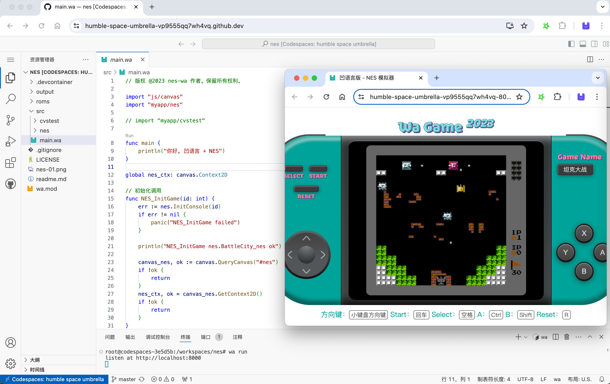
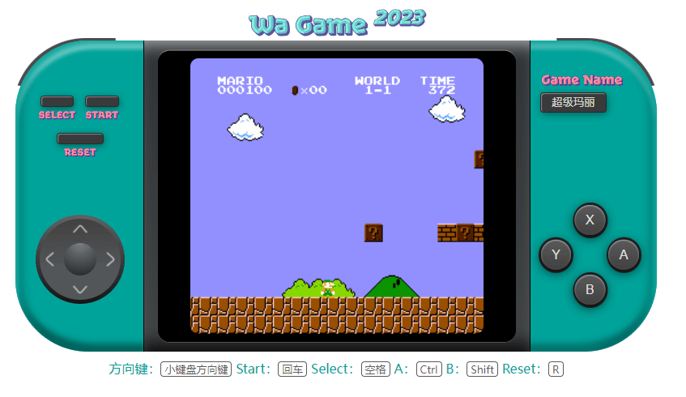

# NES 模拟器 - 凹语言实现

进入工程目录执行 `wa run`

运行效果如下：

在线演示地址：https://wa-lang.org/nes/

桌面版浏览器访问，使用键盘控制：小键盘方向键对应手柄方向键；空格对应手柄 select 键；回车对应手柄 start 键 Ctrl 对应手柄 A 键；Shift 对应手柄 B 键。

手机等触屏设备浏览器访问，直接在 UI 触控：左下方摇杆操作为先在中心按下，然后四向摇动（类似于王者荣耀等手游）；按住 X 键为 A 键连发；按住 Y 键为 B 键连发。
